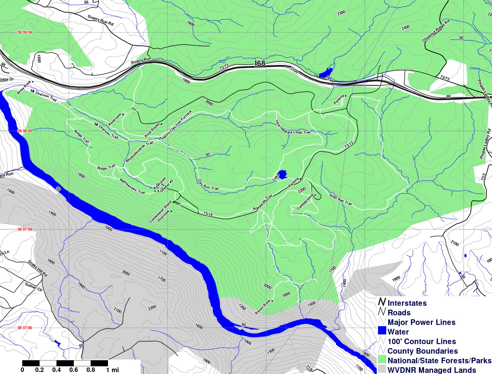

SHP file for a large number of the trails at Coopers Rock State Forest
in Monongalia and Preston Counties, WV. I collected this data over several
years while running and mountain biking on the extensive trail system there.
I used [Quantum GIS](qgis.org) to clean up my source data.

